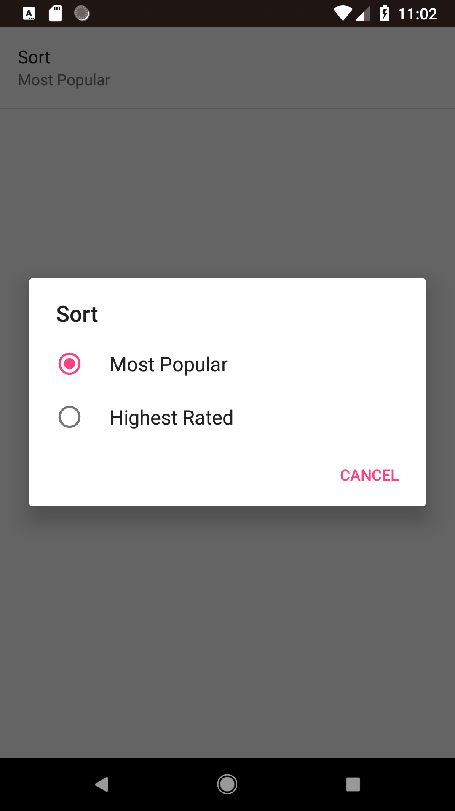

# Popular-Movies
Popular movies app lets you search all the popular and  the top rated movies and you can also get the release date,overview etc.
1.Uses API to get the movies.
2.Used HTTPURLCONNECTION  to form the connection.
3.Picasso library is used to show the posters.
4.Uses RECYCLERVIEW to show the data on the UI.

