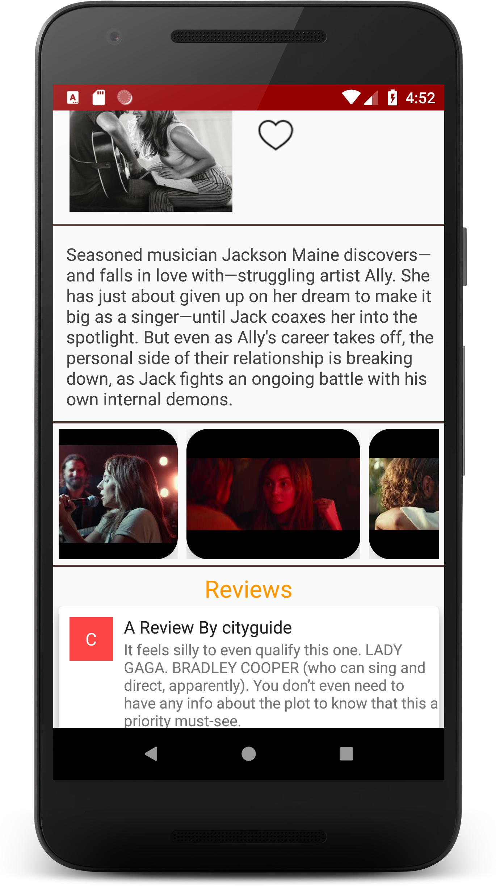

# Popular-Movies
Popular movies app lets you search all the popular and  the top rated movies and you can also get the release date,overview etc.  
You can search for reviews given by the user and you can also see the trailers of the particular movie.  

Some of the fucntionality in this app:- 
----------------------------------------------------
1.Uses API to get the movies. 
2.Used HTTP URL CONNECTION  to form the connection. 
3.Picasso library is used to show the posters. 
4.Uses RECYCLERVIEW to show the data on the movies,trailers,and reviews. 
5.Json parsing of data has been done. 
6.Uses CONTENT PROVIDER to store the favourite movies.

 
 

